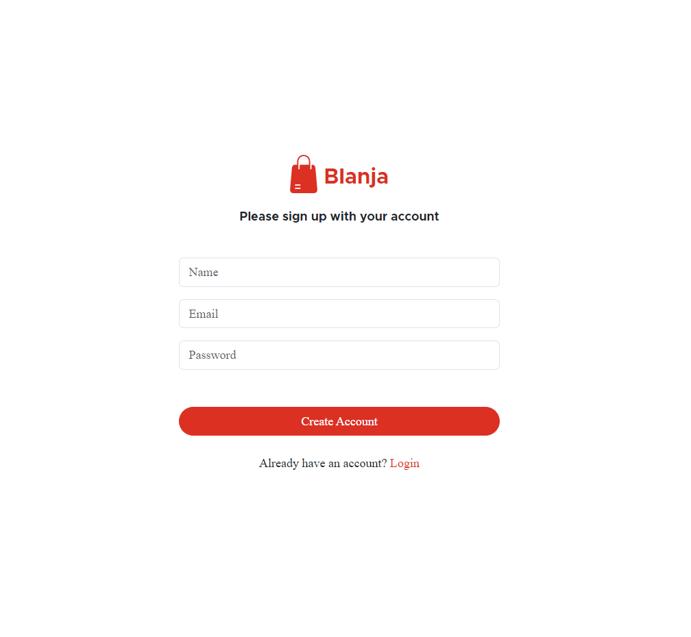
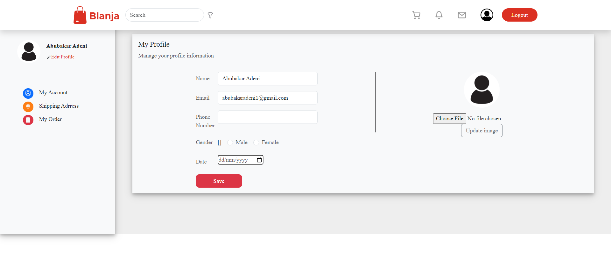
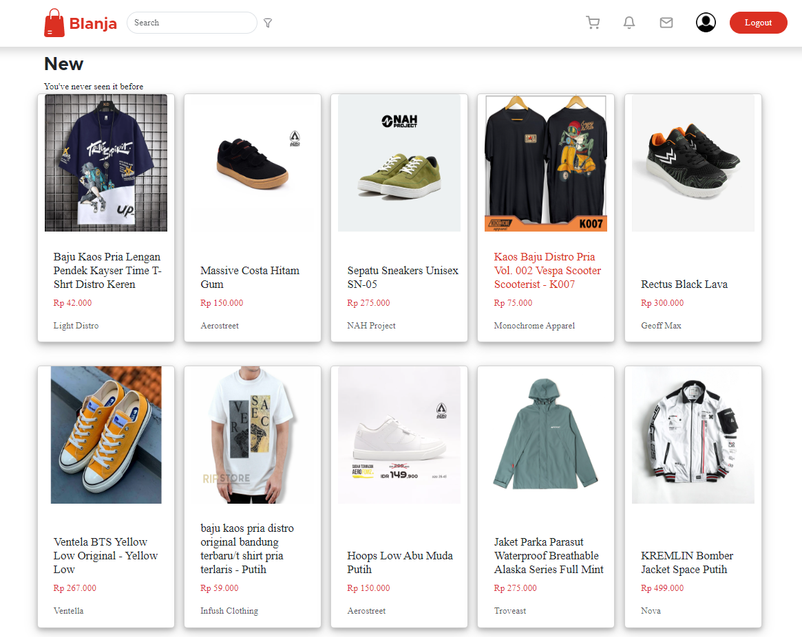
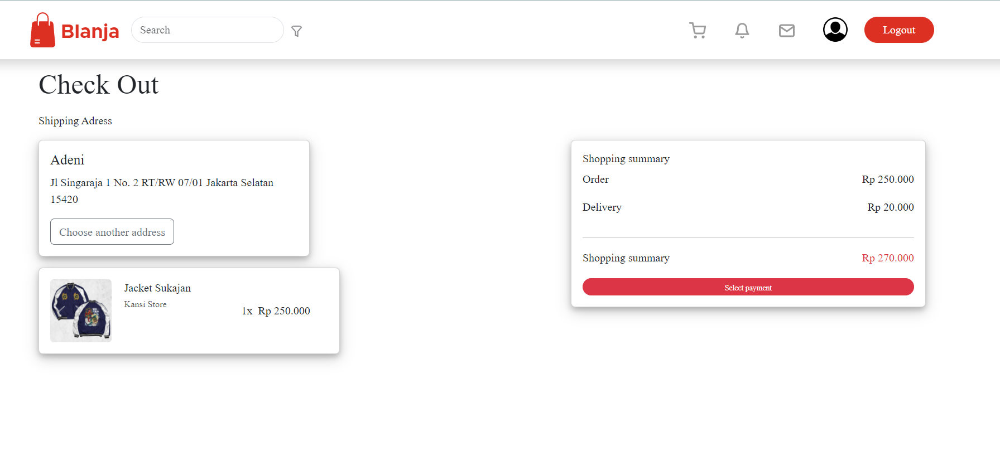

<br />
<p align="center">
  <div align="center">
    
  </div>
  <h3 align="center">Blanja (Blanja App)</h3>
  <p align="center">
    <a href="https://github.com/abubakar-adeni/blanja"><strong>Explore the docs »</strong></a>
    <br />
    <a href="https://blanja-fe-zeta.vercel.app/">View Demo</a>
  </p>
</p>

## Table of Contents

- [About The Project](#about-the-project)
  - [Built With](#built-with)
- [Getting Started](#getting-started)
  - [Prerequisites](#prerequisites)
  - [Installation](#installation)
- [Screenshots](#screenshots)
- [Related Project](#related-project)

# About The Project

Peworld is a hiring website to make it easier to connect workers with recruiters. Workers can create an account and display portfolios, work experiences, and skills on this website. Recruiters can create an account for searching and hiring workers based on company needs. Workers will be notified if they are hired by recruiter.

## Built With

These are the libraries and service used for building this backend API

- 
- 
- 
- 
- 
- 
- [Sweetalert2](https://sweetalert2.github.io)

# Getting Started

## Prerequisites

You'll need these programs installed before proceeding to installation

- [Git](https://git-scm.com/downloads)
- [Node.js](https://nodejs.org/en/download)

This project requires [peworld-be](https://github.com/ikkair/peworld-be) to function properly, follow the steps provided in the readme to install and run the backend API

## Installation

Follow this steps to run the server locally

1. Clone this repository

```sh
git clone https://github.com/abubakar-adeni/hirejob_fe.git
```

2. Change directory to hirejob-frontend

```sh
cd hirejob_fe
```

3. Install all of the required modules

```sh
npm install
```

4. Create and configure `.env.local` file in the root directory, example env are provided in [.env.local.example](./.env.local.example)

```env
NEXT_PUBLIC_HOST=[ Backend URL ]
```

5. Run this command to run the server in development environment

```sh
npm run start
```

- Run this command to build this website into production ready

```sh
npm run build
```

# Screenshots


<br>

<table>
 <tr>
    <td></td>
    <td> </td>
  </tr>
  <tr>
    <td>Login</td>
    <td>Register</td>
  </tr>
  <tr>
    <td> </td>
    <td> </td>
  </tr>
   <tr>
    <td>Edit Profile</td>
    <td>Product Pages</td>
  </tr>
  <tr>
    <td></td>
    <td> </td>
  </tr>
   <tr>
    <td>Search</td>
    <td>Detail Product</td>
      <tr>
    <td></td>
    <td> </td>
  </tr>
   <tr>
    <td>Payment</td>
    <td>Checkout</td>
</table>

# Related Project

:rocket: [`Frontend Peworld`](https://github.com/abubakar-adeni/hirejob_fe)

:rocket: [`Backend Peworld`](https://github.com/kubil-ismail/hire_job_be)

:rocket: [`Demo Peworld`](https://hirejob-fe-tqqw.vercel.app/)
